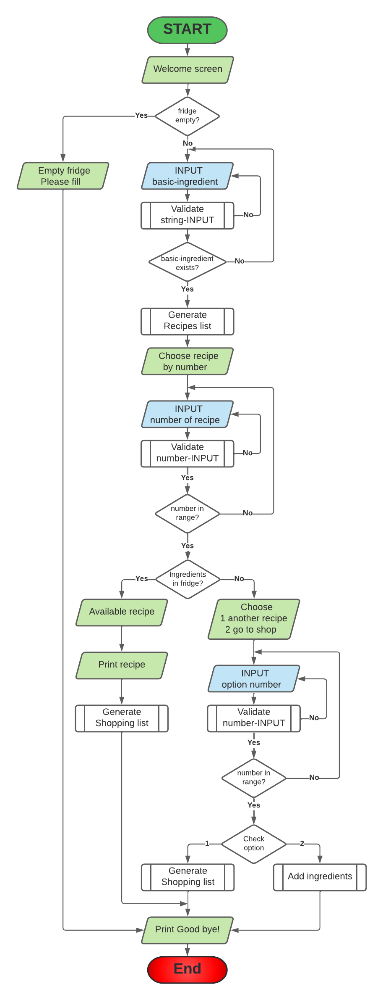
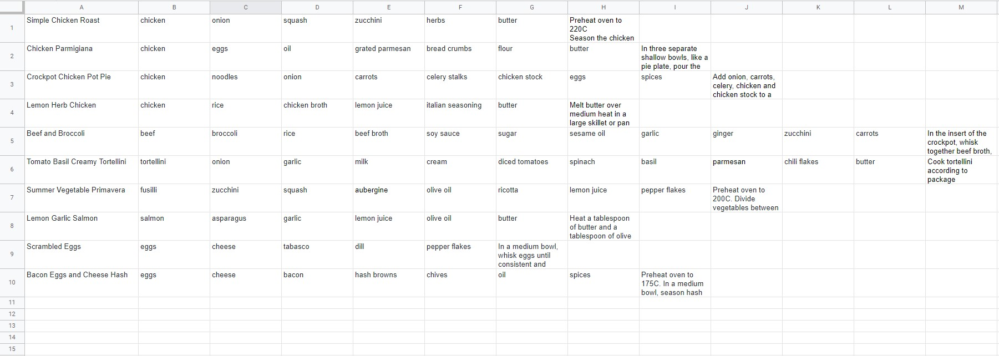
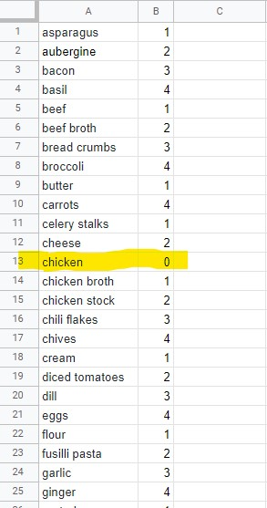

# inFridge

## Project overview

The purpose of this app is to help and fill any hungry belly out there. The app connects to a Google Sheet file. The file stores favorite recipes and infridge ingredients. The app generates a recipe based on infridge ingredients or a shopping list if no recipe is available.

inFridge is for everyone who cooks. From students, single parents, busy professionals to kids who want to surprise their parents or grandparents.

Instead of wasting hours thinking what to cook for the day, just ask the computer what can you cook with what you have in the fridge.

Live app: [inFridge](https://infridge.herokuapp.com/)

## Table of contents

1. [User Stories](#User-stories)
2. [Features](#Features)
    - [Existing Features](#Existing-Features)
        - [Feature 1](#Feature-1)
        - [Feature 2](#Feature-2)
    - [Future Features](#Future-Features)
        - [Future Feature 1](#Future-Feature-1)
        - [Future Feature 2](#Future-Feature-2)
3. [Flowchart](#Flowchart)
4. [Data Model](#Data-Model)
5. [Technologies Used](#Technologies-Used)
6. [Testing](#Testing)
7. [Deployment](#Deployment)
8. [Credits](#Credits)

---

## User Stories

Although this is a CLI app it doesn't address only to tech savvy people, because it was designed with user interaction in mind.

### As developer

- I want to offer a solution to an everyday problem to help users choose a meal
- I want the user to get a shopping list if a recipe is not available so that the user can still enjoy a favorite recipe
- I want to offer feedback to user input to guide the user through the process of using the app

### As a user

- I want an easy to use app to avoid frustration
- I want information on each step to understand what to do
- I want be able to choose one of may favorite recipe to to enjoy a meal
- I want be able to choose recipes based on an ingredient I fancy to save time sorting through my favorite recipes list
- I want be able to add or remove ingredients so that I have an up to date in fridge ingredients list

[Back to top](#Table-of-contents)

---

## Features

In this section, you can find implemented features as well as some features left for a future development stage.

### Existing Features

#### Feature 1

#### Feature 2

### Future Features

#### Future Feature 1

#### Future Feature 2

[Back to top](#Table-of-contents)

---

## Flowchart

[Back to top](#Table-of-contents)

---

## Data Model

Google Sheets was used to store data in a spreasheet called infridge with two worksheets.

**Recipes worksheet** contains all recipe data. In the first column is recipe name, followed by a number of ingredient cells. In the last cell is the cooking method.

This worksheet has 50 rows and 26 columns, manual expansion is posible from spreadsheet.

**Ingredients worksheet** contains all ingredients data. The first column is for ingredient name and the secon is for ingredient quantity.

This worksheet has 100 rows and 26 columns, expansion is done automatically when updating ingredients.

**Important** At the time of submission "chicken" ingredient was set on 0 for testing, so that each chicken recipe will be unavailable.

[Back to top](#Table-of-contents)

---

## Technologies Used

- [Python 3](https://www.python.org/) - used to write the code for this project
- [Git](https://git-scm.com/) - used for version control
- [Github](https://github.com/) - used to host the repo
- [Gitpod](https://gitpod.com/) - IDE used to write, add, commit and push the code
- [Heroku](https://www.heroku.com) - used to deploy the app
- [Lucidchart](https://www.lucidchart.com/) - used to create the flowchart
- [Google Sheets](https://www.google.co.uk/sheets/about/) - used to store data

[Back to top](#Table-of-contents)

---

## Testing

Testing...

[Back to top](#Table-of-contents)

---

## Deployment

This section describes the process of deploying the project to GitHub Pages and creating an Application in Heroku

### Creating an application in Heroku

1. Use command: pip3 freeze > requirements.txt to create the list of requirements
2. Log into heroku account and create new app
3. In settings tab, set up config vars key=CREDS value=creds.json file content and key=PORT value=8000
4. Add buildpacks Python and Nodejs
5. In deployment tab, connect to GitHub
6. Deploy branch will generate [inFridge app](https://infridge.herokuapp.com/)

### Deploying to GitHub Pages

1. Open a browser and navigate to [Github.com](https://github.com/)
2. Log in to GitHub account
3. Click on "Responsitories" or select "Your repositories" from profile menu at the top right corner
4. Select "project name"
5. Go to "Settings" tab
6. Scroll down until you find "Github pages" and press the link you find there, or just choose "pages" from the left sidebar
7. Under "source" change "none" to  "master" branch and then press "save"
8. Refresh the page (can take a few minutes) and then under "Github pages" you have the new URL for the live project

### Running the project in [Gitpod](https://www.gitpod.io/)

1. Open a browser and navigate to [Github.com](https://github.com/)
2. Log in to GitHub account
3. Click on "Responsitories" or select "Your repositories" from profile menu at the top right corner
4. Select "project name"
5. Add "gitpod.io/#" before URL in address bar and press "enter"

### Running the project locally

1. Open a browser and navigate to [Github.com](https://github.com/)
2. Log in to GitHub account
3. Click on "Responsitories" or select "Your repositories" from profile menu at the top right corner
4. Select "project name"
5. Locate and click on the "Code" button
6. Copy the URL under "HTTPS"
7. In your IDE of choice, create a new repository
8. Type "git clone 'copied URL'" and press enter

[Back to top](#Table-of-contents)

---

## Credits

### Content

Code Institute's [Python essentials template](https://github.com/Code-Institute-Org/python-essentials-template) was used to to create this project.

Code Institute's [Love sandwiches](https://github.com/Code-Institute-Solutions/love-sandwiches-p5-sourcecode) walkthrough project was used as a guide to create this project.

### Media

This is a CLI app therefore no media files were used.

### Acknowledgements

- Thanks to my mentor for help, suggetions and time
- Thanks to my family, friends and peers for suggestions, reviews and feedback.

[Back to top](#Table-of-contents)

---

### *Disclaimer: This project is for learning purposes only*
